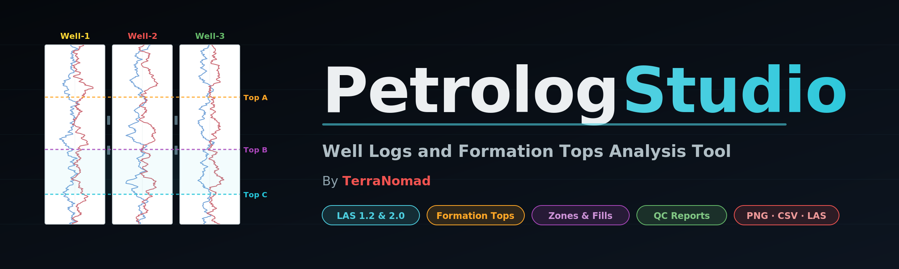

  

<h1 align="center">Petrolog Studio</h1>

<b>Well Logs and Formation Tops Analysis Tool</b> 
By <b style="color:#ef5350;">TerraNomad</b>

  
  
  
  

---

## Overview

**Petrolog Studio** is a single-file, browser-based petrophysics workstation for the oil & gas industry. It loads one or many LAS files, renders professional multi-track well logs, lets you correlate formation tops across wells, build user-defined zones, run statistical analysis, and produce three distinct QC reports — all without installing anything. Open the `.html` file in any modern browser and you are working.

It is designed for:

- **Petrophysicists** quickly QC-ing newly delivered LAS deliverables
- **Geologists** correlating formation tops and zones across a field
- **Reservoir engineers** checking log coverage and data completeness
- **Students and consultants** who want a zero-install, zero-cost tool that rivals the plotting features of commercial packages

---

## Key Capabilities at a Glance

| Area | What you can do |
|---|---|
| **File I/O** | Load multiple `.las` files (LAS 1.2 & 2.0), export to LAS 2.0, CSV, PNG, SVG, PDF |
| **Visualization** | Multi-track, multi-well cross-section view with color, scale, and line-style per curve |
| **Formation Tops** | Import tops via CSV, auto-color, per-well labels, diagonal correlation connectors |
| **Zones** | Define user-coloured intervals between any two tops; fills render across wells |
| **Statistics** | Per-well per-curve statistics table, histograms, crossplots with linear regression |
| **QC** | Log QC and Coverage Report + Formation Tops QC Report + in-line range/depth validation |
| **Exports** | Plot as PNG / SVG, Current well as CSV or LAS 2.0, All wells CSV, full PDF report |

---

## Getting Started

1. **Download** `PetrologStudio.html` (single file, no install).
2. **Open it** in Chrome, Edge, Firefox, or Safari.
3. **Drag and drop** one or more `.las` files onto the drop zone, or click **Load LAS Files**.
4. Use the sidebar to toggle curves and tracks; use the toolbar buttons for stats, QC, and exports.

No server, no backend, no data leaves your machine. Everything runs locally in your browser.

---

## Main Plot — The Well Log Cross-Section

The central view plots every loaded well side by side, each with its own depth axis and a user-configurable set of tracks.

**What you can do here**

- Show/hide individual curves per well
- Set curve color, scale (min/max), line width, log/linear axis, and track assignment
- Choose the depth range to display (top/base in metres or feet)
- Overlay formation tops as horizontal markers across all tracks of each well
- Overlay zones (user-defined intervals between two tops) as semi-transparent color fills
- Draw diagonal correlation lines between the same formation in adjacent wells (Petrel-style)
- Label each formation once per well in the last track so the plot stays clean
- Choose line style globally for formation tops (solid, dashed, dotted) — each style renders correctly thanks to matched shadow strokes

**Why it matters:** this is the workbench you use for actual interpretation — correlation between wells, spotting bad zones, and building a mental model of the reservoir.

---

## Statistics & Analysis Panel

Opened from the toolbar (**📈 Statistics**). Three tabs.

### 1. Statistics Table
A wells × curves matrix of descriptive statistics for each selected curve in each selected well:

- **Min / Max** — extrema over the filtered depth range
- **Mean / Median** — central tendency
- **StdDev** — dispersion
- **P10 / P90** — 10th and 90th percentiles (robust tail descriptors commonly used in petrophysics)
- **Count** — number of valid samples

Headers are colored by well, so comparing the same curve across wells is immediate.

### 2. Histogram
Choose any curve mnemonic and the number of bins (5–100). The panel draws a distribution plot pooling the curve across every selected well. Handy for picking shale cutoffs on GR, or checking that RHOB or NPHI look sensible.

### 3. Crossplot
Pick an **X** curve, a **Y** curve, and optionally a **Color** curve (e.g. GR or Depth). You get:

- A standard 2-D scatter
- A **linear regression** line with equation `y = mx + c`
- The **R²** coefficient of determination
- Point count and well count legend

Perfect for quick RHOB–NPHI crossplots, DT–RHOB acoustic impedance checks, or GR–RT clay indicators.

**Export:** PNG button on the panel exports whichever tab is currently open.

---

## QC Report #1 — Log QC and Coverage Report

Opened from the toolbar (**✓ Log QC and Coverage Report**). Three sections stacked vertically:

### a. Data Coverage Chart
A dense visual coverage grid with two modes:

- **All Logs in Selected Well** — a vertical strip per curve, each painted with coloured blocks wherever non-null data exists and grey wherever it is missing. Each strip shows the completeness % at the top (green ≥ 90%, orange ≥ 50%, red below).
- **Single Log Across Wells** — pick a mnemonic (e.g. GR) and see its coverage over depth across every loaded well, side by side. Instantly spot which wells are short of a particular curve.

This is the single most effective view for checking that a newly delivered dataset is actually complete.

### b. Range Validation
A rules-based sanity checker that looks at each curve by mnemonic and flags typical out-of-bounds readings:

- **GR** (gamma) > 300 API → WARN
- **RHOB** < 1 or > 3.5 g/cc → WARN
- **NPHI / PHI** < −0.15 or > 1 → WARN
- **RT / Rxx / RES** contains zero values → WARN
- Anything else → OK

### c. Depth Validation
Three checks on the depth curve:

- **Monotonic increasing** (PASS / FAIL)
- **Duplicates** — any repeated depth values
- **Null gaps** — stretches where the depth itself is null

**Export:** PNG button on the panel exports the coverage chart.

---

## QC Report #2 — Formation Tops QC Report

Opened from the toolbar (**🎯 Formation Tops QC**). Four summary cards plus three tabs. Answers the question: *"which wells have which tops missing?"*

### Summary Cards
- **Wells** — total wells loaded
- **Unique Tops** — distinct formation tops across all wells
- **Present / Missing** — cell counts
- **Completeness %** — overall fill rate, colored green / orange / red

### Tab 1 — Matrix View
A wells × formations grid:

- **Rows** = wells (sticky first column)
- **Columns** = formations (sticky header, coloured bottom border per formation)
- **Present cell** — coloured dot + depth value on a faint tinted background
- **Missing cell** — red ✕ on a red diagonal-stripe background, immediately visible
- **Score badge** — per-well completeness (e.g. 3/3 green, 2/3 amber)

Sorted by median formation depth from shallow to deep, so the matrix reads like a geological column.

### Tab 2 — By Formation
Per-formation bar chart: how many wells have this top, what its median and min/max depths are, and which wells are missing it.

### Tab 3 — By Well
Per-well bar chart: how complete this well's top set is, and which specific tops are missing.

**Exports:**
- **PNG** — rasterizes the panel body (uses SVG `foreignObject`)
- **CSV** — per-well completeness table with depth values for each formation; ready for reports or spreadsheets

---

## Formation Tops & Zones

### Loading Tops
Drop a CSV of tops onto the **Formations** section of the sidebar. Expected columns are flexible — the loader recognises common variants of `Well`, `Top`, `Depth` (or `MD`) — so exports from Petrel, Techlog, or a plain Excel table all work.

### Rendering
Each top becomes a horizontal marker across every track of the well it belongs to. You control:

- **Line style** — solid / dashed / dotted (globally)
- **Line width** — in pixels
- **Show diagonal correlation lines** — connect the same formation between adjacent wells
- **Show labels** — label each formation once per well in the rightmost track

If a well does not have a particular formation, there will be **no line, no label, and no diagonal connector** through it — the connector chain breaks cleanly at the missing well.

### Zones
A zone is the volume between **any two formation tops** that you pick, rendered as a coloured fill across all wells that have both of those tops. You can:

- Create as many zones as you want
- Pick any color and opacity
- Toggle each zone on/off individually
- Delete a zone when you no longer need it

Zones also break cleanly at missing tops — the fill simply does not appear in wells that lack either the top or base formation.

---

## Export Options — In Detail

All exports are launched from the **⬇️ Export** button on the main toolbar, except panel-specific PNG/CSV exports (Statistics, Log QC, Formation Tops QC) which live on each panel header.

### 🖼 Plot as PNG
Rasterizes the current main plot at 2× for high-DPI. Perfect for slide decks.

### 📐 Plot as SVG
Exports the main plot as vector SVG. Open it in Illustrator / Inkscape for press-quality reports or further editing — every curve, label, and marker stays editable.

### 📄 Current Well CSV
Exports the currently selected well, over the current depth range, with only the currently ticked curves. One row per depth, null values left blank. Good for importing a clean subset into another tool.

### 📊 All Wells CSV
Exports every well, every curve, long-format: `WELL, DEPTH, CURVE, UNIT, VALUE`. Ideal for loading into Python / R / Power BI for bulk analytics.

### 🛢 Current Well LAS 2.0
Exports the currently selected well — with only the currently ticked curves and the current depth range — as a valid **LAS 2.0** file with all the standard sections: `~Version`, `~Well`, `~Curve`, `~Parameter`, `~Other`, `~ASCII`. Null values use the canonical `-999.25`. The file is drop-in compatible with Petrel, Techlog, IP, Geolog, and any other industry tool.

### 📕 PDF Report
A multi-page PDF with the plot, well header summary, and curve listing — good as a handover deliverable.

### Panel-specific exports
- **Statistics panel → 📷 PNG** — exports whichever of the three tabs is active
- **Log QC panel → 📷 PNG** — exports the coverage chart
- **Formation Tops QC panel → 📷 PNG + 📄 CSV** — exports the matrix view or the per-well completeness table

---

## File Format Support

| Format | Read | Write |
|---|:---:|:---:|
| LAS 1.2 | ✅ | — |
| LAS 2.0 | ✅ | ✅ |
| CSV (curves) | ✅ | ✅ |
| CSV (formation tops) | ✅ | — |
| CSV (formation tops QC report) | — | ✅ |
| PNG | — | ✅ |
| SVG | — | ✅ |
| PDF | — | ✅ |

LAS 3.0 is not currently supported on either side.

---

## Keyboard & Mouse Tips

- **Drag** on any floating panel header to reposition it
- **Mouse wheel** inside a track scrolls the depth range
- **Checkbox a well** in the sidebar to show/hide it without unloading
- **Color picker** on a curve chip sets that curve's plotted color instantly

---

## Why a Single HTML File?

Petrolog Studio is deliberately distributed as one `.html` file. The reasons:

1. **Zero install** — no Python env, no Node build, no permissions requests
2. **Offline friendly** — once loaded, the tool works without a network
3. **Private** — your LAS data never leaves your browser
4. **Portable** — drop it on a USB stick, a corporate share, or email it

The only external resources are D3.js and jsPDF, both loaded from cdnjs.

---

## Roadmap / Possible Future Work

- LAS 3.0 read/write
- DLIS read
- Shale-volume, porosity, and saturation computed curves
- Multi-well 2-D correlation with interactive top picking
- Export of annotated cross-sections with all tops and zones as PDF

Feedback and pull requests welcome.

---

## License

MIT License — free to use, modify, and distribute. Attribution to **TerraNomad** is appreciated.

---

  <b>Petrolog Studio</b> — By <b style="color:#ef5350;">TerraNomad</b> 
  <i>Well Logs and Formation Tops Analysis Tool</i>

